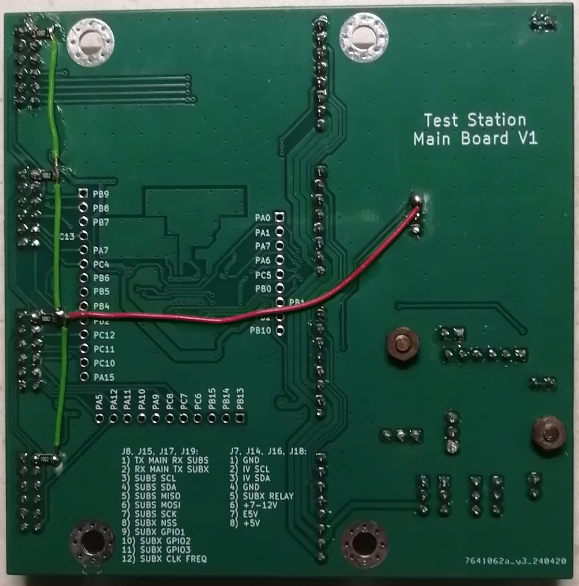

# Test Station Upgrade for Radiation Tests on Microcontroller Boards

Note: The full report is in the repository.

## Abstract

Radiation effects such as Single Event Effects (SEE) and Total Ionising Dose pose significant threats to electronics in space, specifically microcontrollers not designed for this environment, but which are employed in small satellites. Research is being conducted to better understand their behaviour when exposed to radiation. This is done by placing microcontroller boards in a vacuum chamber, where they are connected to a test station that monitors some of their parameters. To facilitate a smoother and more user-friendly testing experience, this project successfully addressed the shortcomings of a previous test station through the design and implementation of a new version that was more reliable and modular, and that offered more features. The second goal with the project was to design and develop a wired, long-distance communication scheme to control the test station from a remote computer by means of a Graphical User Interface (GUI), which was also done successfully. 

## Presentation Video

The following YouTube video presents the project and includes a demo:

## System setup

## Graphical User Interface

## PCB Images

The assembled test station:

The test station main board PCB:

The test station module PCB:

Test subject connection PCB:

